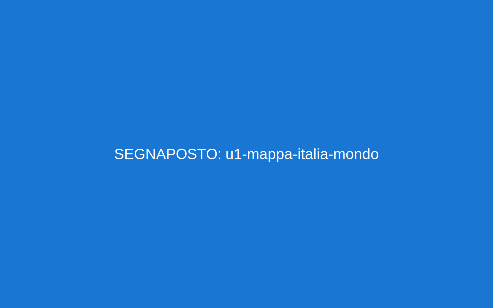
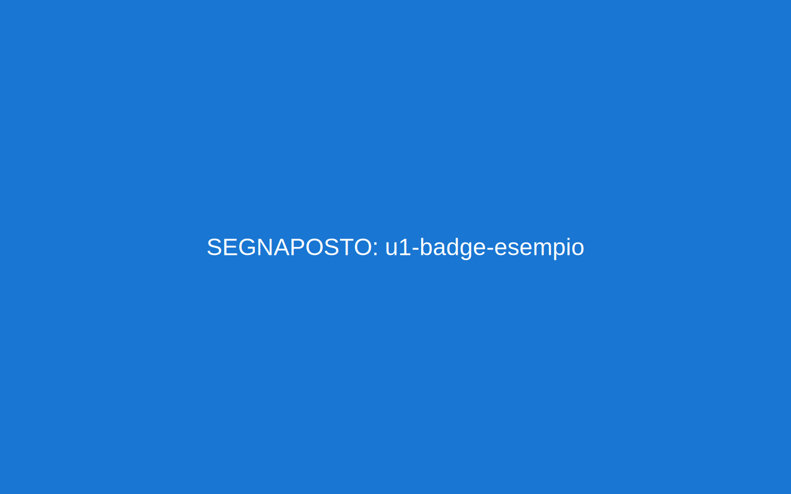

# Unità 1. Mi presento
Percorso A1 per minori stranieri non accompagnati. Linguaggio semplice, esempi, immagini, attività.

Obiettivi
- Dire nome, età, paese/nazionalità, lingua/e, città dove abito.
- Chiedere le stesse informazioni a un’altra persona.
- Scrivere una breve presentazione.

Parole chiave
- nome, cognome, età, anni, data di nascita, paese, città, nazionalità, lingua, Italia, comunità
- io, tu, lui, lei; mi chiamo…, sono…, ho … anni, parlo…, abito a/in…

Frasi utili (modelli)
- Mi chiamo Amina. Ho 16 anni. Sono del Marocco. Abito a Firenze. Parlo arabo e un po’ di italiano.
- Come ti chiami? Quanti anni hai? Di dove sei? Quali lingue parli?
- Lui/Lei si chiama … Ha … anni. È di … Parla …

Dialogo 1 (saluti e presentazione)
A: Ciao! Mi chiamo Sara. E tu?
B: Ciao! Mi chiamo Omar.
A: Quanti anni hai?
B: Ho 17 anni. E tu?
A: Ho 16 anni. Di dove sei?
B: Sono del Senegal. E tu?
A: Io sono italiana. Benvenuto!

Dialogo 2 (presentare un amico)
A: Ciao educatore, lui è Moussa.
B: Piacere, Moussa! Quanti anni hai?
C: Ho 15 anni. Parlo francese e un po’ di italiano.

Immagini
- 
- 
- 

Grammatica facile
- Essere: io sono, tu sei, lui/lei è
- Chiamarsi: io mi chiamo, tu ti chiami, lui/lei si chiama
- Avere (età): io ho 16 anni, tu hai 17 anni, lui/lei ha 15 anni
- Città/paese:
  - Abito a + città (a Roma, a Firenze)
  - Sono del/della + paese (del Senegal, della Guinea)
  - In + paese femminile/plurale (in Italia, in Francia); in + regioni/grandi aree (in Europa)

Pronuncia
- Gli: famiglia [fa-mi-lya], figlio [fi-lyo]
- Gn: bagno [ba-nyo]
- C + i/e = [ci]/[ce]: ciao, cena | Ch + i/e = [ki]/[ke]: chi, parcheggio

Ascolto (QR)
- QR Presentazioni:  – Presentazioni brevi
- QR Domande:  – Domande lente e chiare
Trascrizioni (per l’educatore)
- U1-01A: “Mi chiamo Youssef. Ho sedici anni. Sono del Marocco. Parlo arabo e un po’ di italiano.”
- U1-01B: “Ciao, sono Lila. Ho quindici anni. Sono della Guinea. Parlo francese.”
- U1-02: “Come ti chiami? Quanti anni hai? Di dove sei? Quali lingue parli?”

Attività
1) Pair-work: scambio di presentazioni
- Obiettivo: dire 4 frasi su di sé.
- Istruzioni: prepara un cartellino nome/paese. Parla con 3 compagni. Usa le frasi modello.
2) Scheda: completa e scrivi
- Mi chiamo ________. Ho ____ anni. Sono di ________. Abito a ________. Parlo ________.
- Scrivi 3 domande per un compagno.
3) Memory: bandiera–paese–lingua (carte da ritagliare)
4) Ascolto (QR U1-01): sbarra le info corrette (nome / età / paese / lingua).
5) Presento un compagno (orale)
- Intervista il compagno. Poi presenta: “Lui/Lei si chiama … Ha … anni. È di … Parla …”

Cultura e convivenza
- Salutare guardando negli occhi e con un sorriso è segno di rispetto.
- In Italia si usa “ciao” tra coetanei e “buongiorno/buonasera” con adulti o persone nuove.

Progetto
- Crea il tuo badge con foto (opzionale), nome, paese, lingue, città.

Verifica (A1)
- Ascolto U1-01 (scelta) • Lettura (5 domande) • Scrittura (5 frasi) • Orale (dialogo guidato)

Note accessibilità
- Frasi brevi, font grande, immagini con alt text, esempi concreti e vicini alla loro esperienza.