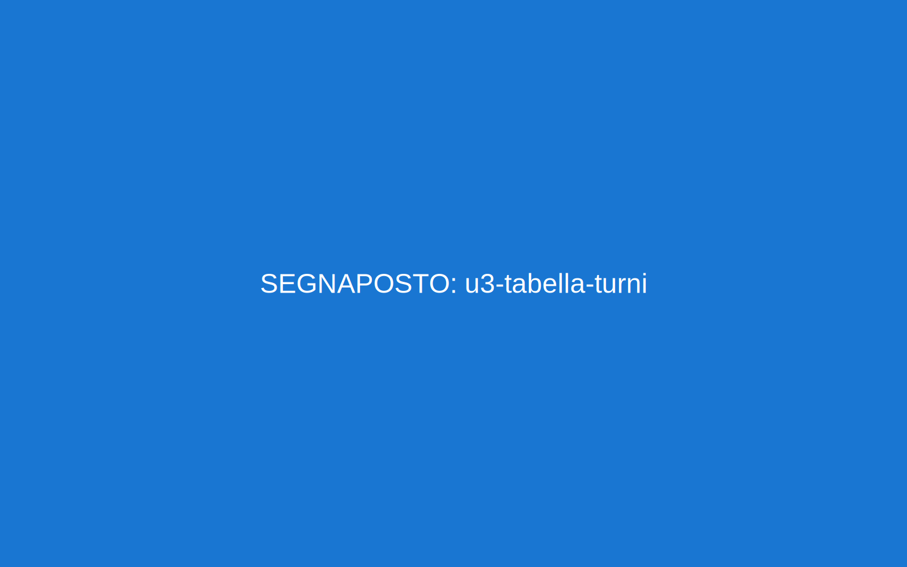
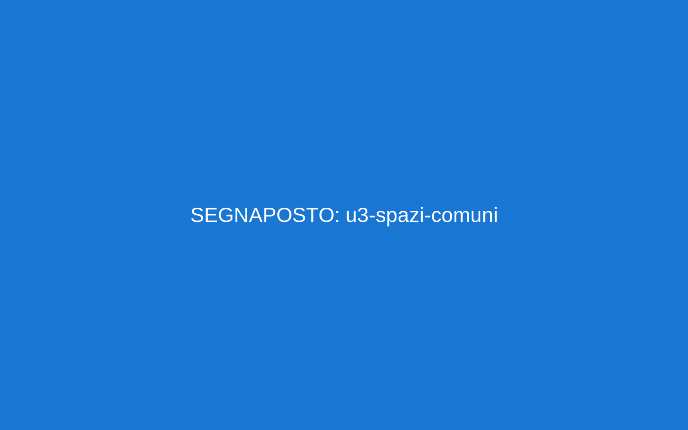

# Unità 3. In comunità: regole, turni, spazi comuni

Obiettivi
- Capire e rispettare le regole della comunità.
- Parlare di turni e spazi comuni.
- Chiedere permesso in modo gentile.

Parole chiave
- regola, orario, silenzio, pulizie, turno, calendario, cucina, sala, camera, bagno, lavanderia, cortile
- rispetto, permesso, vietato, obbligatorio
- si deve…, è vietato…, si può…

Frasi utili (modelli)
- Si deve spegnere la luce alle 23:00.
- È vietato fumare in camera.
- Si può usare la sala dalle 16 alle 18.
- Oggi ho il turno di cucina. Domani ho il turno di pulizie.
- Posso usare il telefono? Posso uscire alle 17:00?
- Devo parlare con l’educatore.

Immagini
- 
- 

Grammatica facile
- Si deve + infinito: Si deve pulire la cucina.
- È vietato + infinito: È vietato mangiare in camera.
- Si può + infinito: Si può studiare in sala.
- Posso + infinito? (chiedere permesso)
- Devo + infinito (obbligo personale)

Pronuncia
- S impura: studio [stù-dio], spazi [spà-zi]
- Z: pulizie [pulizì-e], spesa [spè-sa]

Ascolto (QR)
- QR Regole:  – Regole della comunità
- QR Permesso:  – Chiedere permesso
Trascrizioni (per l’educatore)
- U3-01: “Si deve rispettare il silenzio dalle ventidue e trenta. È vietato fumare in camera. Si può usare la cucina dalle diciassette alle diciannove. Si deve pulire dopo aver cucinato…”
- U3-02A: “Posso chiamare mia sorella alle diciotto?” “Sì, puoi, per dieci minuti.”
- U3-02B: “Posso uscire alle diciassette?” “No, oggi no. C’è studio fino alle diciotto.”

Attività
1) Vero/Falso regolamento (8 frasi)
2) Role-play “permesso” (carte-situazione: telefonare, uscire, usare la sala, invitare un amico, doccia lunga)
3) Crea la tabella turni (lun–dom: cucina, pulizie, rifiuti)
4) Cartelli di avviso: “Silenzio”, “È vietato fumare”, “Si deve spegnere la luce”

Cultura e convivenza
- Condividere spazi = rispettare gli altri: parlare a bassa voce, pulire dopo l’uso, ascoltare le regole.
- In caso di conflitto: fermarsi, respirare, parlare con un educatore.

Progetto
- Poster “La nostra comunità” con foto degli spazi e 1 regola per spazio.

Verifica (A1)
- Ascolto U3-01 (V/F) • Lettura (regolamento breve) • Scrittura (5 regole) • Orale (permessi: 3 situazioni)