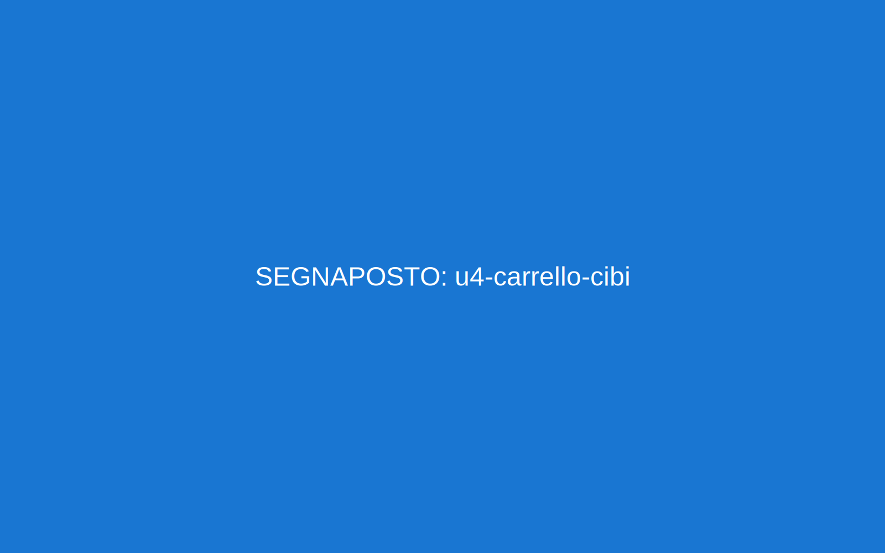

# Unità 4. Al supermercato: cibi, prezzi, lista della spesa

Obiettivi
- Conoscere cibi comuni e reparti del supermercato.
- Chiedere prezzi, leggere etichette e pagare.
- Scrivere una lista della spesa e calcolare il totale.

Parole chiave
- Cibi base: pane, pasta, riso, latte, uova, formaggio, yogurt, pollo, pesce, olio, sale, zucchero, farina, pomodori, mele, banane, patate, cipolle, acqua
- Reparti: frutta e verdura, panetteria, latticini, carne, pesce, bevande, surgelati, igiene
- Acquisto: carrello, cestino, prezzo, offerta, sconto, euro, centesimi, cassa, scontrino, tessera punti
- Quantità: un chilo (1 kg), mezzo chilo (500 g), un litro (1 L), una bottiglia, una confezione, un pacco

Frasi utili (modelli)
- Quanto costa? Costa 1,50 € (un euro e cinquanta centesimi).
- Dov’è il reparto frutta e verdura?
- Vorrei un chilo di mele, per favore.
- È in offerta? Sì, c’è lo sconto del 20%.
- Pago in contanti/con carta. Ecco lo scontrino.

Dialogo 1 (cercare un prodotto)
Cliente: Buongiorno, dov’è la pasta?
Commesso: In corsia tre, a sinistra.
Cliente: Grazie. È in offerta?
Commesso: Sì, questo pacco costa 1,10 €.

Dialogo 2 (alla cassa)
Cassiera: Buongiorno. Ha la tessera punti?
Cliente: Sì, eccola.
Cassiera: Sono 6,30 €. Contanti o carta?
Cliente: Contanti. Ecco 10 €.
Cassiera: Il resto è 3,70 €. Ecco lo scontrino.

Immagini e grafici
- 
- 

Grammatica facile
- Numeri e prezzi: virgola per i decimali (1,50 €).
- Vorrei + nome (formula gentile).
- Questo/Questa/Questi/Queste: questo riso; questa pasta; questi pomodori; queste mele.
- Di + quantità: un chilo di mele; mezzo chilo di pane.

Pronuncia
- Ce/Ci – Che/Chi: ceci [ce-ci], chilo [ki-lo]
- G dolce/duro: gelato [je], grana [g]

Ascolto (QR)
- QR Offerte:  – Annunci di offerte
- QR Cassa:  – Alla cassa: prezzi e resto
Trascrizioni (per l’educatore)
- U4-01: “Pasta a un euro e dieci. Latte a uno e trenta. Mele a due e quaranta al chilo.”
- U4-02: “Totale sei euro e trenta. Contanti o carta? Il resto è tre euro e settanta.”

Attività
1) Volantini veri: trova 5 prezzi e scrivi la lista (prodotto + prezzo).
2) Role-play cliente–commesso: reparto, prezzo, offerta, quantità.
3) Calcolo del resto: paga 5,00 € con 10 €; paga 7,80 € con 20 €.
4) Etichette e quantità: abbina “un chilo/mezzo chilo/una bottiglia/una confezione” alle immagini.
5) Lista della spesa: Prodotto | Quantità | Prezzo | Totale parziale. Somma il totale.

Cultura e convivenza
- In fila alla cassa si aspetta il proprio turno.
- Porta la borsa riutilizzabile per l’ambiente.

Progetto
- “Spesa per una settimana”: budget 25 €. Scegli 8–10 prodotti, calcola il totale e spiega le scelte.

Verifica (A1)
- Ascolto U4-01 (associa prodotto–prezzo) • Lettura (scontrino) • Scrittura (lista 3 giorni) • Orale (prezzi e quantità)